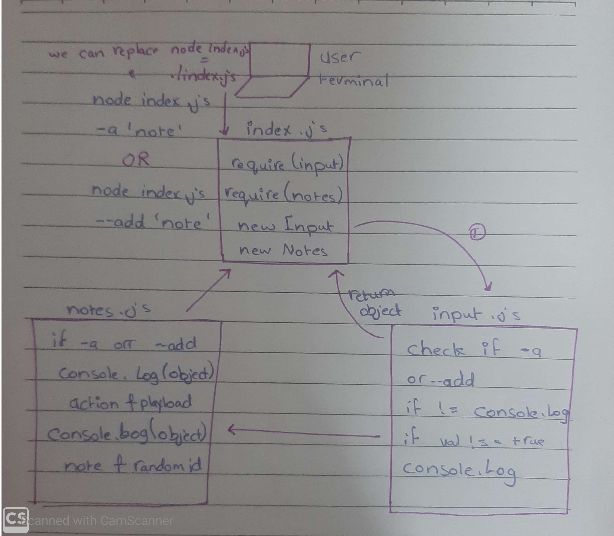

# lab-01-note

## LAB - Class 01
### Project: Notesty
### Author: Fatema Owedah

### Links and Resources

- [submission PR](https://github.com/401-advanced-javascript-fatemaOwedah/lab-00/pull/1)

#### Documintation

### Modules
#### `note.js`
#### `input.js`

### Setup

#### `minimist`
#### `estlint`

#### How to initialize/run your application 

-  `node index.js --add 'your note'`
  -Returns object
-  `node index.js -a'your note'`
  -Returns object
-  `./index.js --add 'your note'`
  -Returns object
-  `./index.js -a'your note'`
  -Returns object

#### Tests

- Lint Tests: `npm run lint`

#### UML

